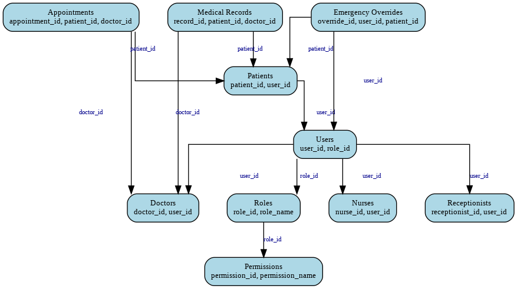

# Hospital Management System (HMS)

## **Overview**  
The **Hospital Management System (HMS)** is a secure, **Role-Based Access Control (RBAC)**-powered platform that streamlines hospital operations while safeguarding sensitive data. Designed for multi-role functionality, it empowers **Admins**, **Doctors**, **Nurses**, **Receptionists**, and **Patients** with tailored permissions for managing hospital activities efficiently.  

This repository includes the **backend** built with **Node.js**, **Express**, and **PostgreSQL**, and the **frontend** developed using **React.js**. Additionally, an **AI-driven diagnostics module** powered by **Python (app.py)** offers machine learning-based diagnostic(78% accuracy) suggestions.  

---

## **Table of Contents**  
- [Project Features](#project-features)  
- [Technologies Used](#technologies-used)  
- [Setup and Installation](#setup-and-installation)  
- [Endpoints Overview](#endpoints-overview)  
- [Frontend Details](#frontend-details)  
- [Screenshots and Files](#screenshots-and-files)  
- [Future Enhancements](#future-enhancements)  

---

## **Project Features**  

### **Backend**  
- **Role-Based Access Control (RBAC)**:  
  - Distinct permissions for Admins, Doctors, Nurses, Receptionists, and Patients.  
- **User Authentication**:  
  - Secure login with **JWT-based authentication**.  
  - Multi-factor authentication for sensitive roles.  
- **Appointment Management**:  
  - Endpoints for scheduling, updating, and canceling appointments.  
- **Medical Record Management**:  
  - CRUD operations for patient medical history and prescriptions.  
- **Emergency Overrides**:  
  - Admin-level functionality to override permissions during critical situations.  
- **AI-Driven Diagnostics**:  
  - Machine learning-based suggestions for diagnosis (via `app.py`).  
- **Error Handling**:  
  - Comprehensive error responses for invalid tokens, roles, and server issues.  

### **Frontend**  
- **Login Page**:  
  - Simple UI to authenticate users and interact with backend APIs.  
- **Role-Based Dashboards**:  
  - Various Dashboard(Admin,patient,doctor... dashboards) for role management and system-wide overview.  
  - Modular pages for handling appointments, medical records, and diagnostics.  

---

## **Technologies Used**  

### **Backend**  
- **Node.js**: JavaScript runtime for server-side applications.  
- **Express.js**: RESTful API framework.  
- **PostgreSQL**: Relational database to store roles, permissions, and operational data.  
- **JWT**: Secure authentication mechanism.  

### **Frontend**  
- **React.js**: Frontend library for building dynamic UI components.  
- **Axios**: HTTP client for interacting with backend APIs.  
- **Bootstrap**: Responsive design framework for styling.  

### **AI-Driven Diagnostics**  
- **Python**: Implements machine learning models for diagnostics via `app.py`.  

### **Tools**  
- **Postman**: For testing and validating APIs.  
- **Git**: Version control for collaboration.  
- **pgAdmin**: PostgreSQL database management.  

---

## **Setup and Installation**  

### **Backend Setup**  
1. **Clone the repository**:  
   
```bash  
 git clone https://github.com/Gopi1603/Hospital.git  
   cd hms-backend
 
``` 

2. **Install dependencies**:  
   ```bash  
   npm install  
   ```  
  

3. **Set up the PostgreSQL database**:  
   - Import the SQL schema located in `/db/hospital.sql`.  
   - Update the `.env` file with the necessary database credentials:  
     ```env  
     DATABASE_URL=your-database-url  
     JWT_SECRET=your-secret-key  
     ```

4. **Start the backend server**:  
   
```bash  
   node server.js  
   ```  

### **Frontend Setup**  
1. **Navigate to the frontend folder**:  
   ```bash  
   cd ../hospital-frontend
   ```  

2. **Install dependencies**:  
   ```bash  
   npm install  
   ```  

3. **Start the development server**:  
   ```bash  
   npm start  
   ```  

### **AI-Driven Diagnostics**  
1. **open Backend**:  
   ```bash  
   cd hms-backend 
   ```  

2. **Run the diagnostics app**:  
   ```bash  
   python app.py  
   ```  

---

## **Endpoints Overview**  

| **Feature**             | **Endpoint**                  | **Description**                             |  
|--------------------------|-------------------------------|---------------------------------------------|  
| Authentication           | `/api/auth/login`            | Login with JWT-based authentication.        |  
| User Management          | `/api/users`                 | CRUD operations for managing users.         |  
| Role Management          | `/api/roles`                 | Assign and manage user roles/permissions.   |  
| Appointments             | `/api/appointments`          | Manage patient appointments.                |  
| Medical Records          | `/api/medical-records`       | View and update patient medical history.    |  
| Telemedicine             | `/api/telemedicine`          | Manage virtual consultations.               |  
| Emergency Management     | `/api/emergencies`           | Handle critical access overrides.           |  
| Diagnostics              | `/api/diagnostics`           | Manage diagnostic test requests/results.    |  

---

## **Frontend Details**  
### **Pages**  
- **Login**: `./pages/Login/Login.js`  
- **Dashboard**: `./pages/Dashboard.js`
- **Appointments**: `./pages/appointments/Appointments.js`  
- **Medical Records**:  
  - View Records: `./pages/medicalRecords/MedicalRecords.js`  
  - Add Records: `./pages/medicalRecords/NewMedicalRecord.js`  
- **Diagnostics**: `./pages/diagnostics/Diagnostics.js`  
- **Emergencies**: `./pages/emergencies/Emergencies.js`  

---

## **Screenshots and Files**  
### **Backend Report**  
- Detailed Postman test results and API documentation: [REPORT_BACKEND.pdf](REPORT_BACKEND.pdf)

### **Login Credentials**  
- Login details for testing roles: [LOGIN_DETAILS.pdf](LOGIN_DETAILS.pdf)

---

## **Future Enhancements**  
1. **Complete Frontend Development**:  
   - Implement fully functional role-based dashboards.  
2. **Real-Time Notifications**:  
   - Add critical alerts for appointments, emergencies, and diagnostics.  
3. **Containerization**:  
   - Deploy using Docker containers for easier scalability.  
4. **Telemedicine Integration**:  
   - Build frontend support for virtual consultations.  
5. **Enhanced AI Diagnostics**:  
   - Expand ML models for advanced suggestions.  

---  

For contributions, issues, or pull requests, feel free to reach out or submit to this repository!

<sub><sup>✨ Built with passion and creativity by [Gopi Chakradhar](https://gopi-chakradhar.vercel.app/) ✨</sup></sub>
